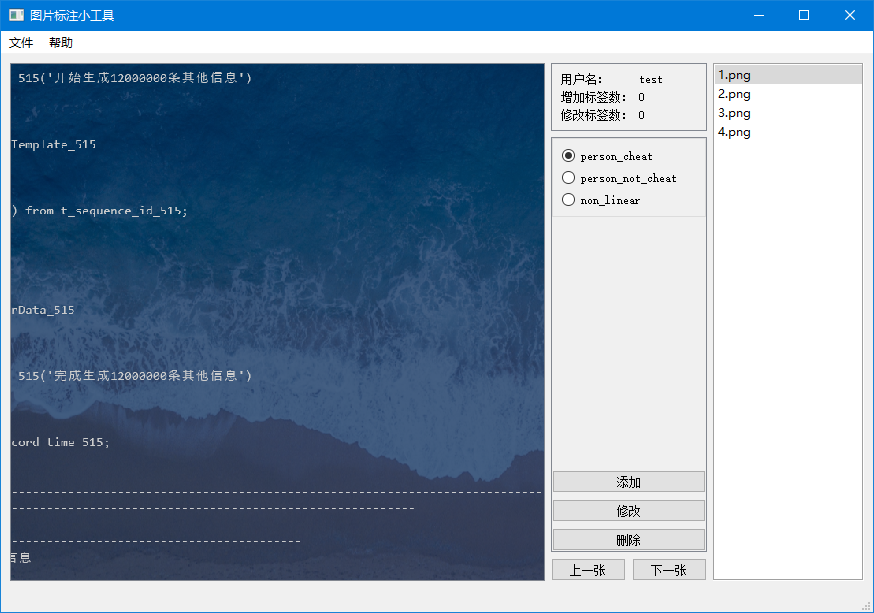

### 简介
这是一个可用于小规模下直接对图片进行标注的软件, 它会将不同标签的图片放到不同文件夹下.

#### 详细信息
1. 登录: 登录界面仅需输入用户名, 用户名只用于区分不同的登录用户的配置, 不做其他处理, 
配置文件会保存在当前目录下的profile.json文件中.
2. 主页面: 主页面如图所示, 如果配置文件保存有您此前的配置,
程序会读取配置文件中的配置, 并直接设置在窗口中.
3. 如果您没有保存在配置文件中的配置, 您需要按照以下步骤配置好您的环境:
    - 点击左上角的"**文件**", 并选择"**打开文件路径**", 此时窗口会按照字典序显示该目录下的所有图片
    - 点击左上角的"**文件**", 并选择"**改变图像保存路径**", 如果没有配置文件, 则您必须手动添加标签
    - 点击左下部分的"**添加**"按钮, 此时会弹出一个窗口并让您添加所需的标签, 添加成功则按下"**确认**"返回主窗口
    - 点击左下部分的"**修改**"按钮, 此时会弹出一个窗口并让您修改所需的标签, 修改成功则按下"**确认**"返回主窗口
    - 点击左下部分的"**删除**"按钮, 程序将会删除您选中的标签并删除在图像保存路径下的该标签文件夹下的所有图片, 因此您必须重新为这些图片
    修改标签
4. 切换图片: 点击"**上一张**", "**下一张**"按钮可以切换图片, 或者您也可以使用键盘上的左右键切换图片, 同时**空格键**也可以切换下一张图片
5. 标注图片: 点击窗口上的**标签按钮**即可标注图片, 或者您也可以选择点击键盘上的1-0十个按钮, 您可以直接选中窗口上的图片而无需点击
6. "增加标签数"与"修改标签数": 这两项将会记录您在本次标注过程中的一些数值, 增加标签数意味着您本次为多少张图片新增了标签, 修改标签数意味着
您本次为多少张图片修改了标签
7. 右侧的"**图片名展示列表**": 图片名展示列表可以展示您当前选择的文件夹下有多少张图片, 您也可以双击列表中的某项从而直接跳转到该图片
8. 左侧的"**图片预览展示**": 如上面的图片展示, 左侧的预览可以直接展示您所想要看到的图片, 如果您认为图片难以分辨, 可以使用滑轮放大缩小或者
移动图片
9. "**帮助**": 帮助会显示该文件的一些信息, 如果您想要获得详细的介绍, 可以参考本文件

#### 文件结构
. 
├── ReadMe.md 
├── dialog 
│   ├── label_dialog.py 
│   └── login_dialog.py 
├── imgs 
│   └── interface.png 
├── main.py 
├── main_window.py 
├── config.py 
├── ui 
│   ├── label_dialog.ui 
│   ├── main_window.ui 
│   ├── ui_label_dialog.py 
│   └── ui_main_window.py 
└── util 
    └── image_with_mouse_control.py 

#### 依赖

PyQt5